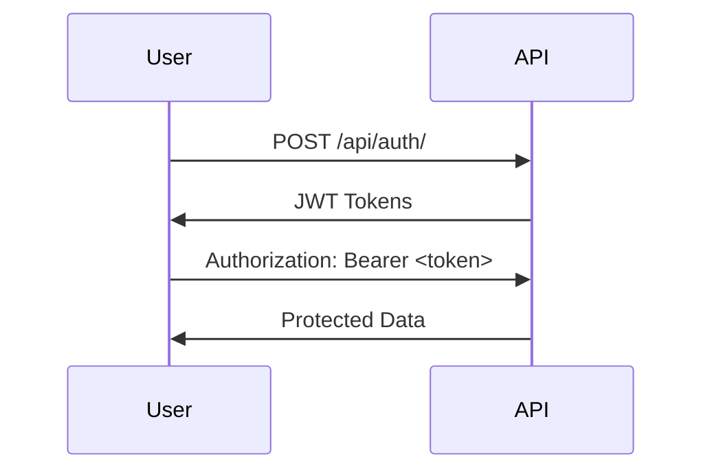

# 🛍️ E-Commerce Backend API

<div align="center">
  
  
  
</div>

## 🚀 Quick Start
```bash
git clone https://github.com/anonymous-lad2/e-commerce.git
cd e-commerce/back_end
python -m venv env
source env/bin/activate  # Linux/Mac
# env\Scripts\activate  # Windows
pip install -r requirements.txt
python manage.py migrate
python manage.py runserver

🔐 Authentication Flow


🌐 API Endpoints

Endpoint	Method	Description	Auth
/api/auth/	POST	Get JWT tokens	    ❌
/api/products/	GET	List products	    ❌
/api/orders/	POST	Create order	✅
/api/users/me/	GET	User profile	    ✅

🔧 Developer Tools
```bash
./dev_tools.sh djcheck  # Custom checks
pytest  # Run all tests
python manage.py shell  # Test data:
>>> from store.factories import ProductFactory
>>> ProductFactory.create_batch(5)
```

📦 Project Structure
e-commerce/
└── back_end/
    ├── ecommerce/       # Config
    ├── store/           # Main app
    │   ├── migrations/  # DB
    │   ├── tests/       # Tests
    │   ├── models.py    # Models
    │   ├── views.py     # Logic
    │   └── serializers/ # Transformers
    ├── manage.py        # CLI
    └── pytest.ini       # Test config

📜 License
MIT © Pablo727


